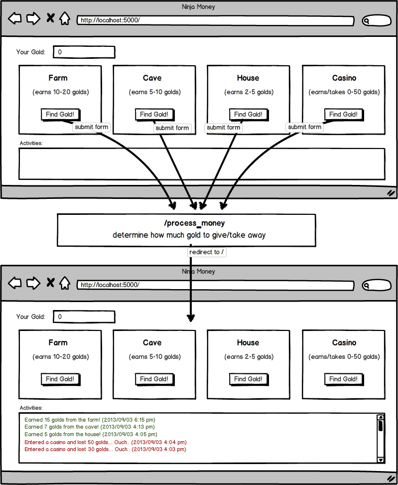

# Ninja Gold
This was an app created using Flask
### Objectives:
* Create a new Flask project called ninja_gold

* Create the template as shown in the wireframe above, with 4 separate forms

* Have the root route render this page

* Have the "/process_money" POST route increase/decrease the user's gold by an appropriate amount and redirect to the root route

* Display all the activities performed by the user in a log on the HTML, as shown in the wireframe

* Have the activities be color-coded as shown above (+ money is green, - money is red)

* Add a reset button to restart the game

* Have the activities display in descending order, with the most recent activity first

* Provide winning parameters to the game--for example, a user must obtain 500 gold in less than 15 moves. Only display the reset button once the user has won or lost.

* Complete the "/process_money" route without 4 conditional statements (i.e. without doing if farm...elif cave...etc.)

## I was given this wireframe as a reference:
